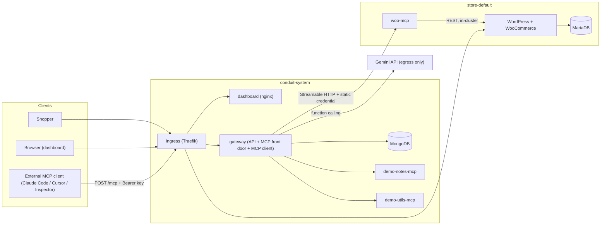
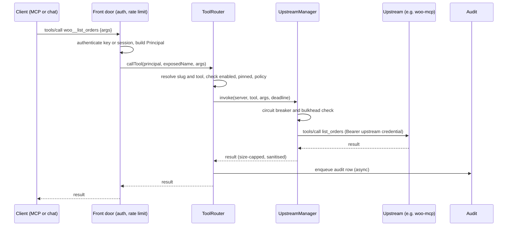

# ARCHITECTURE

## 1. Principles

1. **One front door.** Every tool call, from the chat or from an external client, goes through the same `ToolRouter`, so auth, policy, pinning, timeouts, audit and metrics apply once and identically.
2. **Failure isolation.** Each upstream has its own client, timeout, circuit breaker and concurrency limit (bulkhead). Nothing shared can be blocked by one upstream.
3. **Credentials have one direction.** Secrets go from Kubernetes Secret → process memory → upstream request. They never go to the browser, an MCP client, a log, the audit log or the LLM.
4. **Stateless where possible.** The MCP endpoint is stateless; configuration lives in MongoDB; replicas converge by polling a version counter.
5. **Same charts everywhere.** Environment differences are values only.
6. **Explainable.** No framework magic that you cannot draw on a whiteboard.

## 2. Components

| Component | Tech | Namespace | Exposed | Responsibility |
|---|---|---|---|---|
| dashboard | React + Vite + TS, served by `nginx-unprivileged` | conduit-system | Ingress `dashboard.<domain>` | Admin and member UI, chat UI |
| gateway | Node 22 + Fastify + TS + MCP SDK | conduit-system | Ingress `dashboard.<domain>/api`, `gateway.<domain>/mcp` | REST API for dashboard, MCP server front door, MCP client to upstreams, auth, policy, audit, chat agent |
| mongodb | official `mongo` StatefulSet | conduit-system | none (ClusterIP) | Gateway state |
| woo-mcp | Node + TS + MCP SDK | store-default | none (ClusterIP, gateway-only via NetworkPolicy) | Products/orders tools over the WC REST API |
| wordpress | custom image: `wordpress` + WooCommerce + WP-CLI | store-default | Ingress `shop.<domain>` | Storefront and WP admin |
| mariadb | official `mariadb` StatefulSet | store-default | none | Store database |
| demo-notes-mcp | Node + TS | conduit-system | none | Second upstream (notes), has `ping` and `search` |
| demo-utils-mcp | Node + TS | conduit-system | none | Third upstream (time, calculator, units), has `ping` and `search` |
| demo-rogue-mcp | Node + TS | conduit-system | none, off by default | Malicious-upstream demo (poisoned description, rug-pull toggle) |
| provisioner (bonus) | Node + TS, Helm CLI | conduit-system | none | Store lifecycle; own ServiceAccount and RBAC |
| redis (optional) | official `redis` | conduit-system | none | Shared rate limits when gateway replicas > 1 |

The gateway backend is one deployable. Internally it has strict module boundaries so the chat agent or provisioner client can be split out later.

## 3. Diagrams

### 3.1 System context



### 3.2 Tool call sequence



## 4. Repository layout

```
conduit/
  apps/
    gateway/            src/{config,auth,registry,upstream,router,mcp,audit,chat,ratelimit,metrics,stores,http}/
    dashboard/          src/{pages,components,api,state}/
    woo-mcp/
    demo-notes-mcp/
    demo-utils-mcp/
    demo-rogue-mcp/
    provisioner/        (bonus)
  packages/
    shared/             zod schemas, error codes, types, naming helpers
  images/
    wordpress/          Dockerfile (WooCommerce baked), setup scripts, mu-plugins
  charts/
    woocommerce-store/  WordPress + MariaDB + woo-mcp + setup Job + netpols
    conduit/            gateway + dashboard + mongodb + demo MCPs + ingress + netpols
    (optional umbrella `conduit-all` depending on both for the single-command install)
  values/
    values-local.yaml
    values-prod.yaml
  scripts/              cluster-up.sh, build-load.sh, gen-secrets.sh, e2e/
  docs/
  .github/workflows/
  Makefile
```

## 5. Gateway internals

### 5.1 Modules

| Module | Responsibility |
|---|---|
| `config` | Typed env parsing with zod; fail fast on missing secrets |
| `auth` | Password login (argon2id), sessions, CSRF, API-key verification, `Principal` construction, authenticator chain (`ApiKeyAuth`, later `OAuthAuth`) |
| `registry` | Server CRUD, credential encryption/decryption, config version bump |
| `upstream` | `UpstreamManager`: client per server, health checks, circuit breaker, bulkhead, catalog cache, SSRF-safe dialer |
| `router` | Namespacing, `ToolRouter.list(principal)` / `.call(principal, name, args)`, policy and pinning filters, meta-tool mode |
| `mcp` | MCP server front door (stateless Streamable HTTP), maps MCP requests to `ToolRouter` |
| `audit` | Bounded async queue, retry, fallback to stderr; sync path for security events |
| `chat` | Gemini adapter, schema sanitiser, tool loop, SSE streaming, conversation persistence |
| `ratelimit` | Token bucket per key and per user; memory or Redis backend |
| `metrics` | Prometheus registry, separate listener on 9090 |
| `stores` | Client for the provisioner (bonus) |

### 5.2 MCP front door (inbound)

- `POST /mcp` only. `GET /mcp` returns 405 (no server-initiated stream in stateless mode); `DELETE /mcp` returns 405.
- A new SDK server instance is created per request (stateless), bound to the request's `Principal`. Tool handlers are generated from `ToolRouter.list(principal)`.
- Validates `Origin` when present against `ALLOWED_ORIGINS` (DNS-rebinding protection required by the transport spec). Validates `MCP-Protocol-Version` header per the spec revision the SDK implements.
- Auth: `Authorization: Bearer mcpgw_<prefix>_<secret>`. Missing/invalid → HTTP 401 with `WWW-Authenticate: Bearer`. Revoked → 401 with the same shape (no oracle on why).
- Consequence of stateless: no `tools/list_changed` notifications. Clients re-list; acceptable and documented.

### 5.3 Upstream manager (outbound)

State per server (in memory, derived from Mongo config + health):

```
{ serverId, slug, url, credential(decrypted, memory only),
  client | null, state: connected | unreachable | disabled,
  breaker: { phase: closed|open|half_open, failures, openedAt, backoffMs },
  bulkhead: { inFlight, max },
  catalog: { fetchedAt, tools[] }, lastError: { code, message, at } }
```

Behaviour:
- **Connect lazily and on config change**, with `connectTimeoutMs` (3 s). Reconnect on transport error.
- **Health loop** every 15 s per server with jitter: MCP `ping`, and `tools/list` refresh every 60 s (or when a `list_changed` notification arrives on the upstream connection if one is open).
- **Circuit breaker**: open after 3 consecutive failures; open duration starts at 10 s, doubles to a 60 s cap, with jitter; half-open allows one probe; success closes it.
- **Bulkhead**: default 8 concurrent calls per upstream; excess fails fast with `upstream_busy` instead of queueing without bound.
- **Timeouts**: list 3 s (but normally served from cache); call default 30 s, configurable per server up to 120 s; the deadline is passed down as an `AbortSignal`.
- **Catalog cache** is what `tools/list` serves. It is refreshed in the background, never on the request path (except on cold start with a bounded wait).
- **Config convergence**: each replica polls `system_state.configVersion` every 5 s; on change it reloads the registry diff. Admin API writes bump the version.
- **SSRF-safe dialer**: custom DNS lookup that validates every resolved IP, then connects to that IP; redirects disabled. See SECURITY.md.
- Response size cap (default 1 MB) and text sanitisation on results.

### 5.4 Naming, aggregation and routing

- Exposed name: `<slug>__<tool>`; slugs are unique, lowercase, no `__`, must start with a letter (Gemini requires a letter or underscore first).
- Over 64 chars: truncate the tool part and append `_` + 6 hex of SHA-256(original). A reverse map is kept so routing stays exact.
- `tools/list` = union over servers where `enabled && breaker != open && state == connected`, for tools that are `approved` (pinned hash matches) and allowed by policy for the principal.
- Each tool's description is prefixed with `[<server display name>] ` so humans and models can see provenance. Descriptions are sanitised (see SECURITY.md).
- `tools/call`: parse slug by the first `__`, load server, check enabled, pinned, policy, rate limit, then invoke. Unknown, denied and quarantined tools all return the same "Unknown tool" protocol error so existence is not leaked.

### 5.5 Pinning (tool-poisoning defence)

On each catalog refresh the gateway hashes `{name, description, inputSchema, annotations}` per tool.
- First sight → `status: pending` (hidden) unless the server is `trusted` (first-party seeded) or the admin ticked "approve on add".
- Hash differs from the approved hash → `status: changed` (hidden) and an admin event is raised; the dashboard shows a diff.
- Admin approves → hash stored, tool visible.

### 5.6 Policy

Rule: `{ scope: role|user, subjectId|role, serverId|'*', toolPattern (glob on upstream tool name), effect: allow|deny }`. Evaluation: explicit user deny > explicit user allow > role deny > role allow > default. Default is `allow` for admin, and `allow` for member unless a deny matches (configurable to default-deny in prod). Convenience rule type: "members: read-only tools only" using `readOnlyHint` — only honoured for servers marked `trusted` because hints from untrusted servers are claims, not facts.

### 5.7 Many-tools mode (stand-out)

If visible tools exceed `META_MODE_THRESHOLD` (default 40) the chat agent, and external clients that connect to `/mcp?mode=meta`, see two tools: `gateway_search_tools(query, limit)` and `gateway_call_tool(name, arguments)`. Search is a BM25-style keyword index over name + description + server name, built in memory from the visible catalog. Calls made through `gateway_call_tool` run through the identical policy/audit path and are audited under the underlying tool name.

## 6. Chat agent

- Endpoint: `POST /api/chat` (session auth + CSRF), response is Server-Sent Events.
- Loop: build messages (system prompt, history, user turn) → Gemini with function declarations from `ToolRouter.list(principal)` → if function calls: execute each through `ToolRouter.call(principal{source:chat}, ...)`, append results, repeat → stop on text answer, 8 iterations, or the 90 s turn deadline.
- Parallel function calls from the model run concurrently with a cap of 4.
- Tool results are truncated to 20 KB and wrapped in an untrusted-data envelope (PROMPTS.md §2).
- Events: `turn_start`, `text_delta`, `tool_call {id,name,server,args}`, `tool_result {id,ok,durationMs,summary}`, `error {code,message}`, `done {usage}`.
- Persistence: `conversations` and `messages` (including tool trace). Never persisted: credentials, full system prompt.
- Schema sanitiser: converts MCP JSON Schema to what Gemini accepts (drops `$schema`, `additionalProperties`; flattens simple `anyOf`/`oneOf`; caps depth). Unit-tested against the real woo-mcp schemas. If the SDK accepts raw JSON Schema, pass it through and keep the sanitiser as fallback.
- Optional confirmation gate: tools with `destructiveHint` or matched by a "confirm" rule pause the loop and emit `confirm_required`; the UI shows Approve/Deny. Off in `values-local.yaml`, on in `values-prod.yaml`.

## 7. woo-mcp design

- Transport: stateless Streamable HTTP on `:3100/mcp`; `/healthz` (liveness), `/readyz` (store reachable, cached 5 s).
- Auth: requires `Authorization: Bearer <MCP_BEARER_TOKEN>` (constant-time compare). Defence in depth on top of the NetworkPolicy.
- Store access: `fetch` to `http://wordpress.store-default.svc.cluster.local/wp-json/wc/v3/...` with Basic auth (consumer key/secret) and `X-Forwarded-Proto: https`. Timeout 10 s; retries only for GETs on connection errors, max 2.
- Why REST, not WP-CLI or direct SQL: scoped, revocable credential; WooCommerce business logic and hooks run (stock, taxes, emails); no pod-exec RBAC; works against any store, including remote ones.
- Tools (all with zod input schemas and annotations):

| Tool | Notes | Annotations |
|---|---|---|
| `list_products` | `search`, `status`, `per_page` (≤ 50), `page` | readOnly |
| `get_product` | by id | readOnly |
| `create_product` | `name`, `regular_price` (string decimal), optional `description`, `status` default `publish`, `sku` | not readOnly, not destructive |
| `update_product` | partial update | not destructive |
| `list_orders` | `status`, `after`, `before` (ISO 8601), `date_preset: today|yesterday|last_7_days` computed in `STORE_TIMEZONE`, `per_page`, `page` | readOnly |
| `get_order` | by id, trimmed line items | readOnly |
| `update_order_status` | enum of valid WC statuses | destructive hint on `cancelled`/`refunded` |
| `sales_summary` | totals for a preset period, computed server-side | readOnly |

- Output is trimmed (id, name, price, status, totals, line items, billing name/email only where needed) to protect model context and PII.

## 8. Kubernetes topology

### 8.1 Namespaces and Pod Security
- `conduit-system`: label `pod-security.kubernetes.io/enforce=restricted`.
- `store-*`: `enforce=baseline` (documented WordPress exception, see SECURITY.md), `warn=restricted`.

### 8.2 Workloads

| Workload | Kind | Replicas | Requests | Limits | Startup | Readiness | Liveness |
|---|---|---|---|---|---|---|---|
| gateway | Deployment | 1 local / 2 prod | 100m / 256Mi | 500m / 512Mi | HTTP `/healthz` fail 30 × 2 s | `/readyz` = Mongo ping only | `/healthz` = event loop responsive |
| dashboard | Deployment | 1 / 2 | 25m / 32Mi | 100m / 64Mi | – | GET `/` | GET `/` |
| mongodb | StatefulSet | 1 | 100m / 256Mi | 500m / 768Mi | exec `mongosh ping` | exec ping | exec ping |
| woo-mcp | Deployment | 1 / 2 | 50m / 96Mi | 250m / 192Mi | – | `/readyz` | `/healthz` |
| wordpress | Deployment (Recreate, RWO PVC) | 1 | 200m / 384Mi | 1000m / 768Mi | HTTP `/wp-login.php` fail 60 × 5 s | `/wp-login.php` | TCP 80 |
| mariadb | StatefulSet | 1 | 100m / 256Mi | 500m / 512Mi | exec `healthcheck.sh --connect --innodb_initialized` | same | `mariadb-admin ping` |
| demo MCPs | Deployment | 1 | 25m / 64Mi | 100m / 128Mi | – | `/readyz` | `/healthz` |
| wp-setup | Job (helm post-install/post-upgrade hook) | – | 100m / 256Mi | 500m / 512Mi | `backoffLimit: 6`, `activeDeadlineSeconds: 600` | – | – |

Values above are starting points; tune with `kubectl top` and record the final numbers in the README.

### 8.3 Storage
- PVCs: `mariadb-data` (5 Gi local, 20 Gi prod), `wp-content` (2 Gi / 10 Gi), `mongodb-data` (2 Gi / 10 Gi). StorageClass from values; default `local-path` on k3d and single-node k3s.
- `helm.sh/resource-policy: keep` on store PVCs so `helm uninstall` does not delete data by accident; teardown of provisioned stores deletes the namespace explicitly.
- Backups (prod): `CronJob` running `mariadb-dump` and `mongodump` to a PVC or object storage; restore procedure documented.

### 8.4 Ingress and domains
- `ingressClassName: traefik` (value). Hosts from `global.domain`: `dashboard.`, `gateway.`, `shop.` prefixes.
- Local: `*.localhost`. Browsers resolve it to loopback automatically; for CLI/Node clients that do not, add hosts-file entries or set `global.domain=127.0.0.1.nip.io`. k3d maps host port 80 → load balancer (if port 80 is taken, use 8080 and set `global.publicPort`; WordPress `WP_HOME`/`WP_SITEURL` are derived from these values so redirects stay correct).
- Prod: real DNS A records to the VPS, TLS via cert-manager (`ClusterIssuer` Let's Encrypt), `ingress.tls.enabled=true`.
- Gateway Ingress for `/mcp` sets generous read timeout and disables response buffering. Request body size limit 1 MB.

### 8.5 Network policies (default deny, explicit allow)

| From → To | Port | Allowed |
|---|---|---|
| Ingress controller → dashboard | 8080 | yes |
| Ingress controller → gateway | 3000 | yes |
| Ingress controller → wordpress | 80 | yes |
| gateway → mongodb | 27017 | yes |
| gateway → woo-mcp (store-default) | 3100 | yes (namespace + pod selector) |
| gateway → demo MCPs | 3200+ | yes |
| gateway → internet (Gemini) | 443 | yes, egress to 443 only |
| woo-mcp → wordpress | 80 | yes (same namespace) |
| wordpress → mariadb | 3306 | yes |
| everything else, including woo-mcp → mariadb, any pod → woo-mcp | – | **denied** |
| all pods → kube-dns | 53 | yes |

Prove it in the demo with `kubectl exec` attempts that time out (a prepared script in `scripts/netpol-proof.sh`).

### 8.6 Service accounts and RBAC
- All workloads: dedicated ServiceAccount, `automountServiceAccountToken: false`.
- Exception: provisioner (bonus) with a narrow ClusterRole (namespaces, resourcequotas, limitranges, networkpolicies, secrets, PVC, deployments, statefulsets, services, ingresses, jobs in `store-*` namespaces) bound per namespace via RoleBindings it creates itself. Namespace create/delete cannot be prefix-scoped by RBAC alone: document this, and add a ValidatingAdmissionPolicy that only lets the provisioner touch namespaces labelled `conduit.io/managed=true`.

### 8.7 Pod security context (all conduit-owned containers)
`runAsNonRoot: true`, fixed UID/GID, `readOnlyRootFilesystem: true` with `emptyDir` for `/tmp`, `allowPrivilegeEscalation: false`, `capabilities.drop: [ALL]`, `seccompProfile: RuntimeDefault`.

## 9. Helm structure and values

```
charts/conduit/
  Chart.yaml  values.yaml
  templates/ _helpers.tpl gateway-{deployment,service,hpa,pdb,sa}.yaml
             dashboard-*.yaml  mongodb-statefulset.yaml  demo-mcps.yaml (range)
             ingress.yaml  networkpolicies.yaml  migrations-job.yaml (pre-upgrade hook)
             seed-job.yaml (registers first-party servers; idempotent)  servicemonitor.yaml (optional)
charts/woocommerce-store/
  templates/ wordpress-*.yaml mariadb-*.yaml woo-mcp-*.yaml setup-job.yaml
             ingress.yaml networkpolicies.yaml quota-limitrange.yaml (bonus, behind flag)
```

Values differences (what the README's "local → VPS" section should tabulate):

| Key | `values-local.yaml` | `values-prod.yaml` |
|---|---|---|
| `global.domain` | `localhost` | `example.com` |
| `global.publicPort` | `80` (or 8080) | `443` |
| `ingress.tls.enabled` | false | true + cert-manager issuer |
| `images.pullPolicy`, `images.repository` | `IfNotPresent`, locally imported | `Always`/digest, `ghcr.io/<you>/...` + pull secret |
| `storage.className` | `local-path` | `local-path` or provider class; larger sizes |
| `gateway.replicas`, `pdb`, `hpa` | 1, off, off | 2+, on, on |
| `secrets.existing.*` | names created by `make secrets` | names created by SOPS/Sealed Secrets/manual |
| `chat.confirmDestructive` | false | true |
| `policy.defaultMember` | allow | deny (explicit allows) |
| `networkPolicy.enabled` | true | true |
| `metrics.serviceMonitor.enabled` | false | true if Prometheus Operator present |
| `resources` | small | tuned |
| `demo.rogue.enabled` | optional | false |

## 10. Configuration surface (gateway)

Secrets (from Kubernetes Secret via `envFrom` or per-key refs): `MONGO_URI`, `SESSION_SECRET`, `API_KEY_PEPPER`, `CREDENTIAL_ENC_KEYS` (`kid1:base64,kid0:base64`; first is active), `BOOTSTRAP_ADMIN_PASSWORD`, `GEMINI_API_KEY`, `WOO_MCP_BEARER_TOKEN` (for seeding the first server).
Plain config (ConfigMap): `PUBLIC_DASHBOARD_URL`, `PUBLIC_GATEWAY_URL`, `ALLOWED_ORIGINS`, `BOOTSTRAP_ADMIN_EMAIL`, `GEMINI_MODEL`, `SSRF_ALLOWED_HOSTS` (first-party in-cluster hostnames), `LIST_TIMEOUT_MS`, `TOOL_CALL_TIMEOUT_MS`, `MAX_RESULT_BYTES`, `AUDIT_RETENTION_DAYS`, `RATE_LIMIT_PER_MIN`, `META_MODE_THRESHOLD`, `LOG_LEVEL`.

## 11. Gateway REST API (dashboard)

All under `/api`, JSON, session cookie + `x-csrf-token` on mutations, `x-request-id` echoed.

| Area | Endpoints | Role |
|---|---|---|
| Auth | `POST /auth/login`, `POST /auth/logout`, `GET /auth/me`, `POST /auth/accept-invite` | any |
| Users | `GET /users`, `POST /invites`, `PATCH /users/:id` (role, disable) | admin |
| Keys | `GET /keys` (own; admin: all), `POST /keys`, `DELETE /keys/:id` (own; admin: any) | member/admin |
| Servers | `GET /servers`, `POST /servers`, `PATCH /servers/:id`, `DELETE /servers/:id`, `POST /servers/test`, `GET /servers/:id/tools`, `POST /servers/:id/tools/approve` | admin (GET: member sees name, status, tools only) |
| Policies | `GET/PUT /policies` | admin |
| Audit | `GET /audit` (own for members; all for admin), `GET /audit/export.csv`, `GET /admin-events` | member/admin |
| Chat | `POST /chat` (SSE), `GET /conversations`, `GET /conversations/:id`, `DELETE /conversations/:id` | member/admin |
| Stats | `GET /stats/servers` | admin |
| Stores (bonus) | `GET/POST/DELETE /stores` | member (own) / admin |
| Ops | `GET /healthz`, `GET /readyz`; `:9090/metrics` (internal only) | – |

## 12. Observability

- Logs: `pino` JSON, redaction paths for `authorization`, `*.credential`, `*.password`, `*.apiKey`; fields `requestId`, `userId`, `serverSlug`, `tool`, `outcome`, `durationMs`.
- Metrics: `gateway_tool_calls_total{server,tool,outcome}`, `gateway_tool_call_duration_seconds{server}` (histogram), `gateway_upstream_up{server}`, `gateway_circuit_state{server}`, `gateway_bulkhead_rejections_total{server}`, `gateway_auth_failures_total{reason}`, `gateway_audit_dropped_total`, `gateway_chat_turns_total{outcome}`, `gateway_llm_latency_seconds`.
- Dashboard: server cards show failure reason, last success, error rate (24 h) from the audit aggregation.

## 13. Scaling, upgrade, rollback

- **Scaling**: gateway is stateless; run 2+ replicas behind the Service. Each replica holds its own upstream clients. Rate limiting is per replica unless `REDIS_URL` is set (then shared). Demonstrate with two replicas by killing one while a client keeps calling.
- **Upgrade**: `helm upgrade --install --atomic --timeout 10m -f values-prod.yaml`. Pre-upgrade hook Job runs MongoDB migrations (expand/contract; the old version must keep working with the new schema so rollback is safe). WordPress image bump triggers the post-upgrade setup Job (`wp core update-db`).
- **Rollback**: `helm history`, `helm rollback <rev> --wait`; migrations are additive so no data rollback is needed; PVCs are kept.
- **Graceful shutdown**: `preStop` sleep 5 s, `terminationGracePeriodSeconds: 60`, SIGTERM stops accepting new requests, drains in-flight calls (max 30 s), closes upstream clients, flushes the audit queue.
- `PodDisruptionBudget` (`minAvailable: 1`) for gateway and dashboard in prod.

## 14. Bonus: provisioner design (summary)

- Dashboard → gateway `/api/stores` → provisioner (internal ClusterIP, authenticated with a service token).
- State machine and fields in DATABASE.md (`stores`). A reconciler loop with a Mongo lease (single active reconciler) drives `requested → provisioning → ready | failed`, `deleting → deleted`.
- Provisioning steps (each idempotent): create namespace with labels → apply ResourceQuota/LimitRange → create Secrets (random DB/admin/consumer-key/MCP token) → `helm upgrade --install --atomic --timeout 8m` the `woocommerce-store` chart → wait for setup Job and readiness → register `store-<slug>` upstream in the gateway (trusted, auto-approved) → mark `ready`.
- Recovery: on provisioner start, rows in `provisioning` are re-driven if younger than the timeout, otherwise marked `failed` with a reason; `helm upgrade --install` makes retries safe.
- Teardown order: unregister MCP server (tools vanish first) → `helm uninstall` → delete namespace → wait for PVC removal → mark `deleted`.
- Guardrails: `MAX_STORES_PER_USER` (default 2) enforced transactionally; provisioning timeout 10 min; per-namespace NetworkPolicies (default deny + the table above, with no cross-namespace ingress except from the gateway to woo-mcp).
- Naming: tools are `store-<slug>__list_orders`, display names include the store name, so the agent can compare stores.

## 15. Key tradeoffs

| Choice | Gain | Cost |
|---|---|---|
| Stateless MCP endpoint | Scales, simple | No server-push notifications |
| In-memory catalog cache, polled config | No Redis needed, fast list | Up to ~5 s config lag across replicas |
| Hide unreachable servers' tools | Honest list for models | Client tool lists flap during outages |
| In-process chat router | One policy/audit path, no minted tokens | Chat and gateway share a process (split later behind the same interface) |
| Official images, own StatefulSets | Control, no catalogue dependency | You maintain probes/init yourself; not HA |
| REST for WooCommerce | Safe, portable | Needs the HTTPS-header trick in-cluster; REST rate/latency overhead |
| Pinning + approvals | Blocks tool poisoning | Admin friction (mitigated by trusted first-party servers) |
